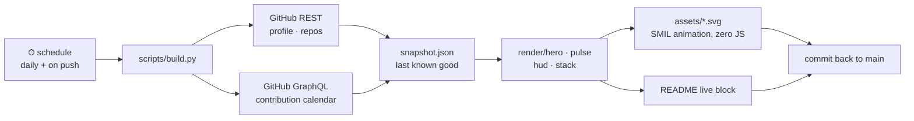

<p align="center">
  <a href="#-whoami"><b>whoami</b></a> ·
  <a href="#-the-terminal"><b>terminal</b></a> ·
  <a href="#-telemetry"><b>telemetry</b></a> ·
  <a href="#-capability-radar"><b>capabilities</b></a> ·
  <a href="#-how-this-page-builds-itself"><b>how it works</b></a> ·
  <a href="#-establish-connection"><b>contact</b></a>
</p>

---

## ⟢ Uplink

<!-- LIVE:START -->

> `uplink established` — this block rewrites itself once a day. Last sync **06 Sep 2026 · 02:19 (BRT)**.

| latest push | language | when |
|:--|:--|:--|
| [`italodevjs`](https://github.com/italodevjs/italodevjs) | `Python` | `0min ago` |
| [`rafael-almeida-imoveis`](https://github.com/italodevjs/rafael-almeida-imoveis) | `HTML` | `2mo ago` |
| [`itdv`](https://github.com/italodevjs/itdv) | `Luau` | `2mo ago` |
| [`badge-unlock`](https://github.com/italodevjs/badge-unlock) | `JavaScript` | `2mo ago` |
| [`hb-team-premium`](https://github.com/italodevjs/hb-team-premium) | `TypeScript` | `5mo ago` |

**9** repositories · **1** stars · **9** followers · **36444** contributions in the last year across **99** active days.

Primary languages: **Lua** 29% · **Python** 14% · **HTML** 14% · **Luau** 14%

<!-- LIVE:END -->

---

## ⟢ `whoami`

I build products end to end and then try to break them before somebody else does.
Full-stack engineering is the craft; **security is the constraint I design against** —
threat modelling before the first migration, hardening before the first deploy.

```ts
const italo = {
  role:     'Full-Stack Engineer',
  focus:    'application security & secure architecture',
  approach: ['model the threat', 'ship the feature', 'harden the surface'],
  base:     'Brazil 🇧🇷 → remote, worldwide',
  belief:   'security is not a feature you add — it is a property you preserve',
} as const;
```

<details>
<summary><b>🇧🇷 Versão em português</b></summary>

<br/>

Construo produtos de ponta a ponta e depois tento quebrá-los antes que outra pessoa quebre.
Desenvolvimento full-stack é o ofício; **segurança é a restrição que guia o projeto** —
modelagem de ameaças antes da primeira migração, hardening antes do primeiro deploy.

- **Front-end** — React, Next.js e TypeScript, com foco em performance e acessibilidade
- **Back-end** — Node.js, NestJS e Python, APIs REST e GraphQL com contratos bem definidos
- **Segurança** — OWASP Top 10, revisão de código, hardening de infraestrutura, zero-trust
- **Plataforma** — Docker, Linux, Nginx e CI/CD no GitHub Actions

Aberto a colaboração, pesquisa de segurança e projetos que precisem sobreviver ao mundo real.

</details>

---

## ⟢ The terminal

*This README has a shell. Expand a command to run it.*

<details>
<summary><code>root@italo:~$ cat /etc/principles</code></summary>

<br/>

```
01  Assume breach. Trust nothing by default, verify everything by design.
02  Ship fast — but never ship a vulnerability you already know about.
03  Read the source before you trust the abstraction.
04  Automate the boring; obsess over the critical path.
05  The best defence is a working understanding of the offence.
06  Complexity is where bugs hide. Simple code is safer code.
07  Stay curious. The exploit almost always lives in the edge case.
```

</details>

<details>
<summary><code>root@italo:~$ ls -la ~/interests</code></summary>

<br/>

```
drwxr-xr-x  appsec/            OWASP Top 10, secure code review, threat modelling
drwxr-xr-x  architecture/      boundaries, contracts, systems that stay understandable
drwxr-xr-x  performance/       the part of UX nobody notices until it is gone
drwxr-xr-x  automation/        if it happened twice, it should not happen a third time
drwxr-xr-x  reverse-eng/       taking things apart to learn how they were meant to work
-rw-------  .coffee            permission denied
```

</details>

<details>
<summary><code>root@italo:~$ ./deploy --checklist</code></summary>

<br/>

What I actually run before anything reaches production:

| stage | check |
|:--|:--|
| `build` | types clean, lint clean, no committed secrets |
| `test` | happy path plus the edge case that scared me |
| `review` | authz on every route, input validated at the boundary |
| `harden` | least privilege, security headers, dependencies pinned |
| `observe` | logs, alerts, and a rollback I have actually rehearsed |

</details>

<details>
<summary><code>root@italo:~$ sudo access --level root</code></summary>

<br/>

```
[ !! ] nice try.
[ ok ] but curiosity is the right instinct — that is the whole job.

       if you read this far, you are exactly the kind of person
       I like building things with. say hello. ↓
```

</details>

---

## ⟢ Telemetry

Every panel below is generated from this account's real state and redrawn on a schedule.
No third-party stats service is involved — the SVGs are compiled by [`scripts/build.py`](scripts/build.py).


---

## ⟢ Capability radar


---

## ⟢ How this page builds itself

Most profile READMEs are a collage of other people's services. This one is a build artifact:
a scheduled job reads the GitHub API, renders every panel as hand-written SVG, and commits
the result back to this repository.



| file | what it does |
|:--|:--|
| [`scripts/build.py`](scripts/build.py) | fetches the data, caches it, renders every panel, rewrites the live block |
| [`scripts/render/hero.py`](scripts/render/hero.py) | the masthead — glitch typography and a boot sequence on one SMIL timeline |
| [`scripts/render/pulse.py`](scripts/render/pulse.py) | a year of commits redrawn as an ECG trace |
| [`scripts/render/hud.py`](scripts/render/hud.py) | language allocation, vitals and the most recent pushes |
| [`scripts/render/stack.py`](scripts/render/stack.py) | capability radar and toolchain, every mark drawn from primitives |
| [`scripts/render/common.py`](scripts/render/common.py) | shared palette, grid, scanline and typewriter primitives |

Design constraints worth naming: GitHub renders these files as **images**, so there is no
JavaScript available — every animation is SMIL living inside the document. There are no
external fonts, no icon CDN and no tracking pixels. If the API is rate-limited or down, the
build falls back to the last committed snapshot instead of rendering empty panels.

Want to run it yourself?

```bash
git clone https://github.com/italodevjs/italodevjs && cd italodevjs
GITHUB_TOKEN=<your token> python3 scripts/build.py   # stdlib only, no dependencies
```

---

## ⟢ Establish connection

<p align="center">
  <a href="mailto:caetanoitalo60@gmail.com"><b>EMAIL</b></a> &nbsp;·&nbsp;
  <a href="https://www.linkedin.com/in/italodevjs"><b>LINKEDIN</b></a> &nbsp;·&nbsp;
  <a href="https://github.com/italodevjs"><b>GITHUB</b></a> &nbsp;·&nbsp;
  <a href="https://www.instagram.com/italogains"><b>INSTAGRAM</b></a>
</p>

<p align="center">
  <sub>Open to collaboration, security research, and problems that deserve a careful engineer.</sub>
</p>

<p align="center">
  <sub><code>connection closed by remote host — but the door is unlocked.</code></sub>
</p>
