<p align="center">
  <b>Full-stack engineer.</b> I build products end to end,<br/>
  then try to break them before somebody else does.
</p>

<p align="center">
  <a href="#-whoami">whoami</a> ·
  <a href="#-the-terminal">terminal</a> ·
  <a href="#-telemetry">telemetry</a> ·
  <a href="#-establish-connection">contact</a>
</p>

---

<!-- LIVE:START -->

**9** public repos &nbsp;·&nbsp; **1** star &nbsp;·&nbsp; **9** followers

**44,988** contributions in the last year, across **106** active days.

**Latest pushes**

[`italodevjs`](https://github.com/italodevjs/italodevjs) · Python · 23h ago<br/>[`rafael-almeida-imoveis`](https://github.com/italodevjs/rafael-almeida-imoveis) · HTML · 2mo ago<br/>[`itdv`](https://github.com/italodevjs/itdv) · Luau · 2mo ago

<sub>rebuilt automatically · last sync 12 Sep 2026 · 06:17 BRT</sub>

<!-- LIVE:END -->

---

## ⟢ `whoami`

Security is the constraint I design against — threat modelling before the
first migration, hardening before the first deploy.

```ts
const italo = {
  focus: 'application security & secure architecture',
  loop:  ['model the threat', 'ship it', 'harden the surface'],
  base:  'Brazil 🇧🇷 → remote',
};
```

**Front-end** React · Next.js · TypeScript
**Back-end** Node.js · NestJS · Python
**Security** OWASP Top 10 · code review · hardening
**Platform** Docker · Linux · Nginx · GitHub Actions

<details>
<summary><b>🇧🇷 Em português</b></summary>

<br/>

Construo produtos de ponta a ponta e depois tento quebrá-los antes que outra
pessoa quebre. Segurança é a restrição que guia o projeto: modelagem de ameaças
antes da primeira migração, hardening antes do primeiro deploy.

Aberto a colaboração, pesquisa de segurança e projetos que precisem sobreviver
ao mundo real.

</details>

---

## ⟢ The terminal

*This README has a shell. Tap a command to run it.*

<details>
<summary><code>cat /etc/principles</code></summary>

<br/>

```
01  Assume breach. Verify everything by design.
02  Ship fast — never ship a known vulnerability.
03  Read the source before trusting the abstraction.
04  Automate the boring, obsess over the critical path.
05  The best defence is understanding the offence.
06  Complexity hides bugs. Simple code is safer code.
07  The exploit lives in the edge case.
```

</details>

<details>
<summary><code>./deploy --checklist</code></summary>

<br/>

What actually runs before anything reaches production:

- **build** — types clean, lint clean, no committed secrets
- **test** — the happy path, plus the edge case that scared me
- **review** — authz on every route, input validated at the boundary
- **harden** — least privilege, security headers, dependencies pinned
- **observe** — logs, alerts, and a rollback I have rehearsed

</details>

<details>
<summary><code>sudo access --level root</code></summary>

<br/>

```
[ !! ] nice try.
[ ok ] but curiosity is the right instinct — it is the whole job.

       if you read this far, you are the kind of person
       I like building things with. say hello. ↓
```

</details>

---

## ⟢ Telemetry







<details>
<summary><b>These panels are not a stats service — they compile themselves</b></summary>

<br/>

Every panel above is hand-written SVG, rendered from this account's real state
by [`scripts/build.py`](scripts/build.py) and committed back here once a day.

GitHub renders these files as **images**, so no JavaScript is available: every
animation is SMIL living inside the document. No external fonts, no icon CDN,
no tracking pixels. If the API is down or rate-limited, the build falls back to
the last committed snapshot instead of rendering empty panels.

```bash
GITHUB_TOKEN=<token> python3 scripts/build.py   # stdlib only, no dependencies
```

</details>

---

## ⟢ Establish connection

<p align="center">
  <a href="mailto:caetanoitalo60@gmail.com"><b>EMAIL</b></a> ·
  <a href="https://www.linkedin.com/in/italodevjs"><b>LINKEDIN</b></a> ·
  <a href="https://www.instagram.com/italogains"><b>INSTAGRAM</b></a>
</p>

<p align="center">
  <sub>Open to collaboration, security research, and problems that deserve a careful engineer.</sub>
</p>
